# MediCareAI Web App

## Overview

MediCareAI is an AI-powered web application designed to enhance healthcare services. It integrates a **ReactJS** frontend, an **ExpressJS** backend, and a **Flask**-based AI model server utilizing a Random Forest algorithm. This project was developed as part of the NT208.O21.ANTN class.

## Note

This repository is a restructured reupload consolidating the previously deleted backend and AI model repositories with the original frontend repository, available at [https://github.com/tdmidas/MediCareAI-frontend](https://github.com/tdmidas/MediCareAI-frontend). The restructuring unifies all components for streamlined management and deployment.

## Team Members

- Trần Dương Minh Đại (22520183)

## Table of Contents

- [MediCareAI Web App](#medicareai-web-app)
  - [Overview](#overview)
  - [Note](#note)
  - [Team Members](#team-members)
  - [Table of Contents](#table-of-contents)
  - [Project Structure](#project-structure)
  - [Prerequisites](#prerequisites)
  - [Installation](#installation)
  - [Dependencies](#dependencies)
    - [Frontend Dependencies](#frontend-dependencies)
    - [Backend Dependencies](#backend-dependencies)
  - [Features](#features)
    - [Basic Features](#basic-features)
    - [Advanced Features](#advanced-features)
  - [Deployment](#deployment)
    - [Firebase Hosting](#firebase-hosting)
  - [Screenshots](#screenshots)
    - [Basic Features](#basic-features-1)
    - [Advanced Features](#advanced-features-1)
    - [Bonus Scoring Criteria](#bonus-scoring-criteria)
  - [Troubleshooting](#troubleshooting)
  - [Contributing](#contributing)
  - [License](#license)
  - [Contact](#contact)

## Project Structure

```plaintext
MediCareAI/
├── MediCareAI-frontend/    # ReactJS frontend
├── MediCareAI-backend/     # ExpressJS backend
├── MediCareAI-model/       # Flask-based AI model server
├── MediCareAI-nestjs/      # Optional NestJS API for testing
└── screenshots/            # Screenshots for documentation
```

## Prerequisites

Ensure the following are installed:
- **Node.js** (v20.x) and **npm**
- **Python** (v3.8+) for AI models
- **pip** (Python package installer)

## Installation

1. **Clone the repository**:
   ```bash
   git clone https://github.com/tdmidas/MediCareAI
   ```

2. **Frontend Setup**:
   - Navigate to the frontend directory:
     ```bash
     cd MediCareAI-frontend
     ```
   - Create a `.env` file with:
     ```plaintext
     REACT_APP_API_URL=<your-api-url>
     REACT_APP_FIREBASE_API_KEY=<your-key>
     REACT_APP_GEMINI_API_KEY=<your-key>
     ```
   - Install dependencies and start the development server:
     ```bash
     npm install
     npm start
     ```

3. **Backend Setup**:
   - Navigate to the backend directory:
     ```bash
     cd MediCareAI-backend
     ```
   - Create a `.env` file with:
     ```plaintext
     FIREBASE_API_KEY=<your-key>
     JWT_SECRET=<your-key>
     AWS_REGION=<your-region>
     AWS_ACCESS_KEY_ID=<your-key>
     AWS_SECRET_ACCESS_KEY=<your-key>
     S3_BUCKET_NAME=<your-bucket-name>
     ```
   - Install dependencies and start the server:
     ```bash
     npm install
     npm start
     ```

4. **Health Prediction Features Setup**:
   - Navigate to the model directory:
     ```bash
     cd MediCareAI-model
     ```
   - Install dependencies and run the Flask app:
     ```bash
     pip install -r requirements.txt
     python app.py
     ```

5. **NestJS API Testing (Optional)**:
   - Navigate to the NestJS directory:
     ```bash
     cd MediCareAI-nestjs
     ```
   - Create a `.env` file with:
     ```plaintext
     FIREBASE_API_KEY=<your-key>
     JWT_SECRET=<your-key>
     ```
   - Install dependencies and start the server:
     ```bash
     npm install
     npm run start
     ```

## Dependencies

### Frontend Dependencies

- antd
- @mui
- date-fns: 3.6.0
- dayjs: 1.11.10
- dotenv: 16.4.5
- firebase: 10.9.0
- markdown-it: 14.1.0
- react: 18.2.0
- react-content-loader: 7.0.0
- react-credit-cards-2: 1.0.2
- react-dom: 18.2.0
- react-icons: 5.0.1
- react-markdown: 9.0.1
- react-markdown-editor-lite: 1.3.4
- react-responsive: 10.0.0
- react-router-dom: 6.22.3
- react-scripts: 5.0.1
- react-speech-recognition: 3.10.0
- react-toastify: 10.0.5
- react-webcam: 7.2.0
- slug: 9.0.0
- slugify: 1.6.6

### Backend Dependencies

- @aws-sdk/client-s3: ^3.565.0
- @google-cloud/local-auth: ^2.1.0
- @google-cloud/vertexai: ^1.1.0
- @google/generative-ai: ^0.8.0
- axios: ^1.6.8
- bcrypt: ^5.1.1
- body-parser: ^1.20.2
- cookie-session: ^2.1.0
- cors: ^2.8.5
- dotenv: ^16.4.5
- express: ^4.19.2
- firebase: ^10.10.0
- googleapis: ^105.0.0
- joi: ^17.12.3
- jsonwebtoken: ^9.0.2
- morgan: ^1.10.0
- multer: ^1.4.5-lts.1
- multer-s3: ^3.0.1
- nodemon: ^3.1.0
- path: ^0.12.7
- serverless-http: ^3.2.0
- uuid: ^9.0.1

## Features

### Basic Features

- **Authentication**: Login and signup with Google, Facebook, or email/password.
- **Account Management**: Update avatar, bio, name, password, etc.
- **Health Records**: Track BMI, blood pressure, blood sugar, and cholesterol.
- **Health Notifications**: Receive health-related alerts.
- **Doctor Interaction**: View doctors, rate them, and read reviews.
- **Blog Interaction**: Read, like, comment, and write blog posts with tagging and images.
- **Search**: Search for doctors and blog posts.

### Advanced Features

- **AI Health Diagnostics**: AI-powered diagnostics using a Random Forest model.
- **Health AI Chatbot**: Interactive chatbot for health recommendations.
- **Blog Post Generation**: Generate blog posts using prompts.
- **Real-Time Monitoring**: Monitor health metrics in real-time.
- **Appointment Management**: Book, manage, and pay for doctor appointments.

## Deployment

### Firebase Hosting

1. Install Firebase CLI:
   ```bash
   npm install -g firebase-tools
   ```
2. Login to Firebase:
   ```bash
   firebase login
   ```
3. Initialize Firebase Hosting:
   ```bash
   firebase init hosting
   ```
4. Build the frontend:
   ```bash
   cd MediCareAI-frontend
   npm run build
   ```
5. Deploy to Firebase:
   ```bash
   firebase deploy --only hosting
   ```

For backend and AI model deployment, use cloud providers like AWS, Vercel, or Heroku. Refer to their documentation for specific instructions.

## Screenshots

### Basic Features

| Feature                            | Screenshot                                             |
| ---------------------------------- | ------------------------------------------------------ |
| **Login**                          | 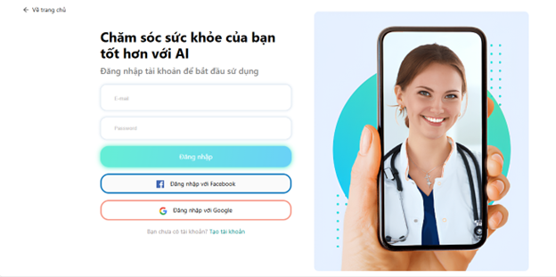                      |
| **Signup**                         | 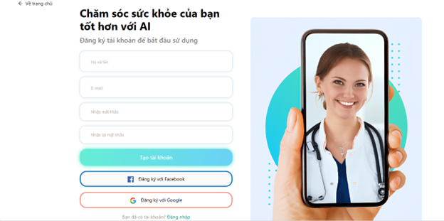                    |
| **Login with Facebook**            | 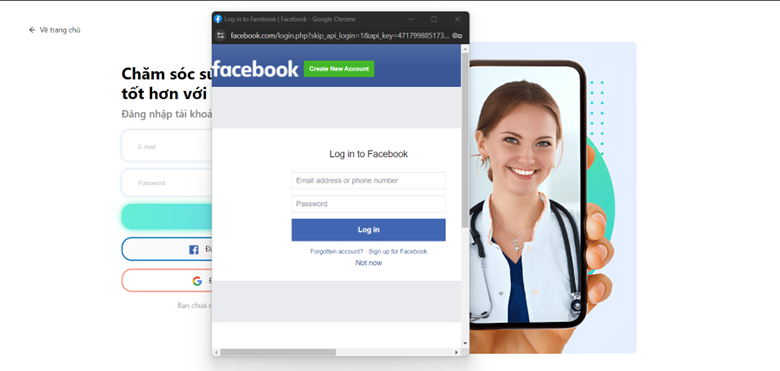          |
| **Login with Google**              | 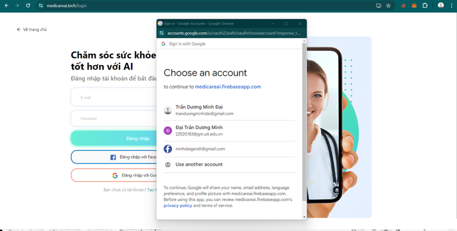              |
| **Account Settings**               | 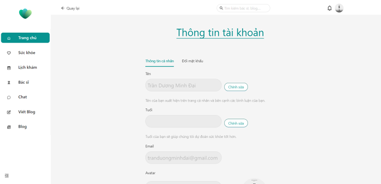 |
| **Change Password**                | 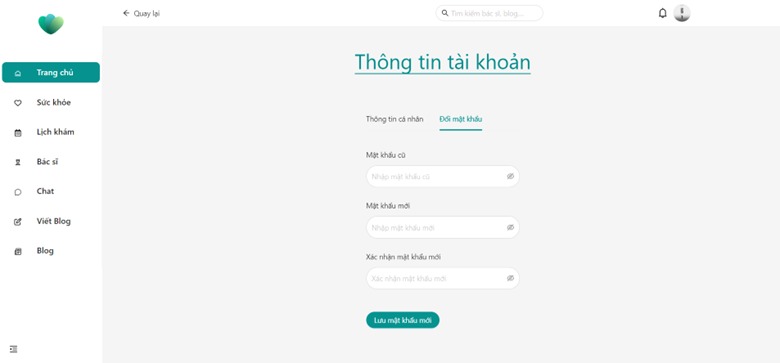  |
| **Health Records: BMI**            | 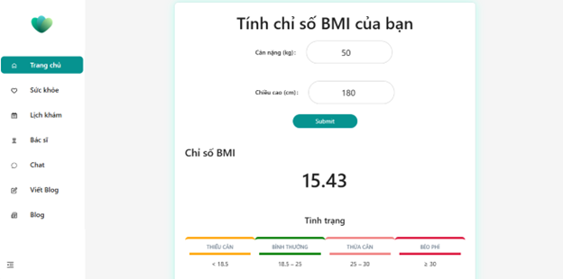                          |
| **Health Records: Blood Sugar**    | 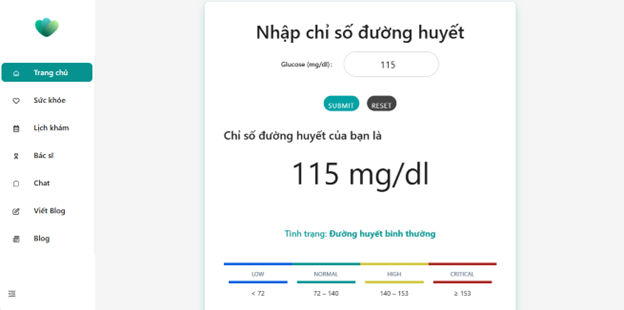              |
| **Health Records: Blood Pressure** | 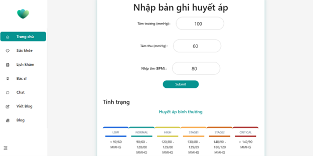    |
| **Health Records: Cholesterol**    | 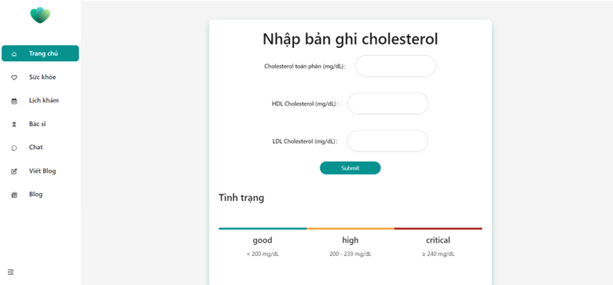          |
| **Health Notification**            | 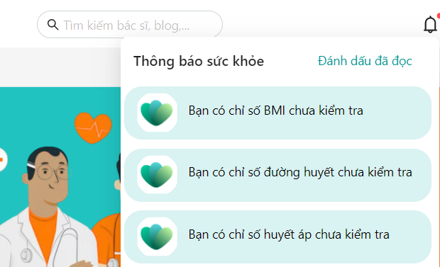        |
| **View Doctors**                   | 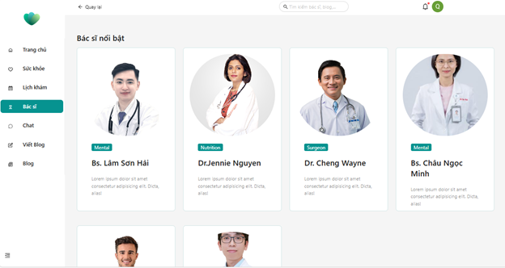                   |
| **Doctor Details**                 | 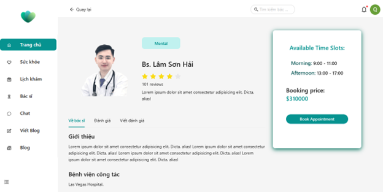     |
| **Rate a Doctor**                  | 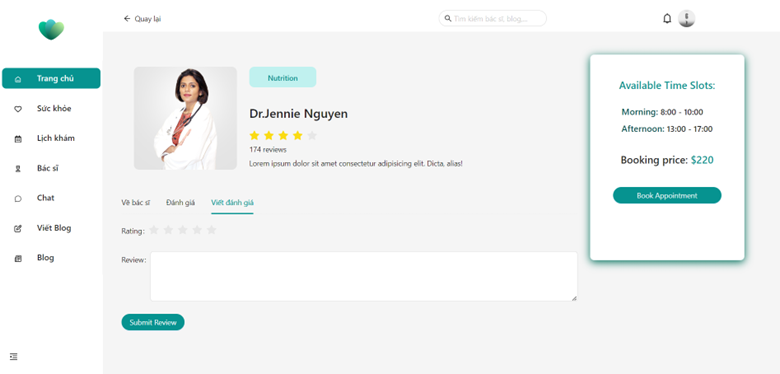                  |
| **View Doctor Ratings**            | 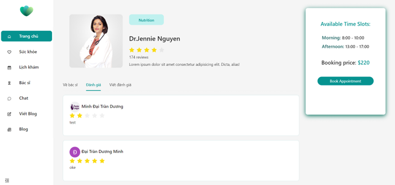           |
| **View Blog Posts**                | 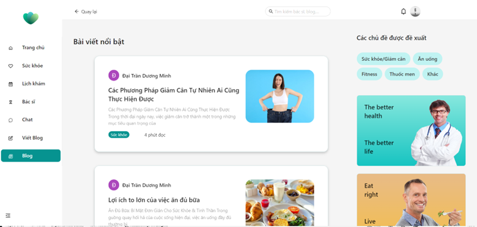                  |
| **Read Blog Post**                 |                |
| **Write Blog Post**                | 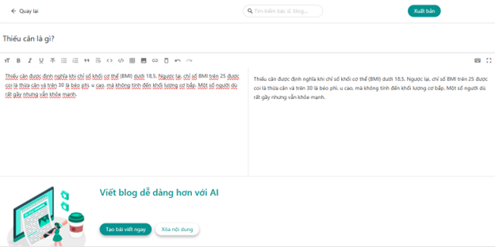                 |
| **Blog Tagging**                   | 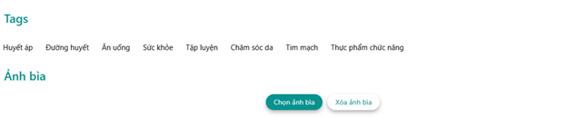                 |
| **Like and Comment**               | 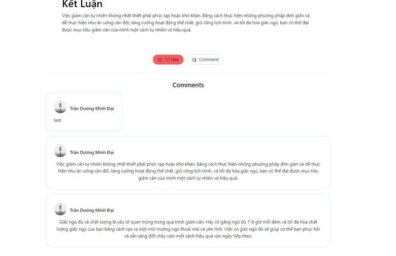        |
| **Search**                         | 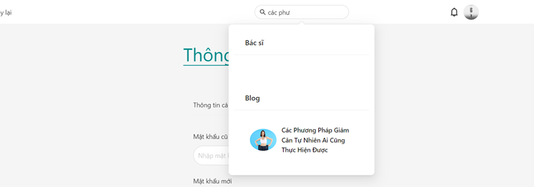                    |

### Advanced Features

| Feature                     | Screenshot                                              |
| --------------------------- | ------------------------------------------------------- |
| **AI Health Diagnostics**   | 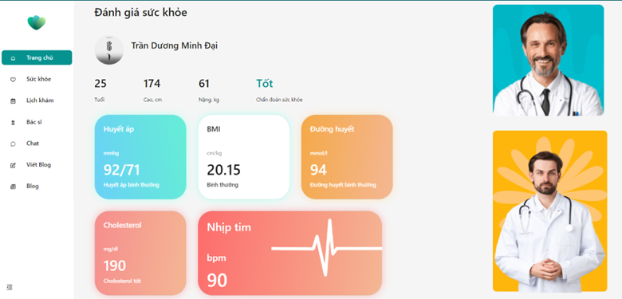        |
| **Health AI Chatbot**       | 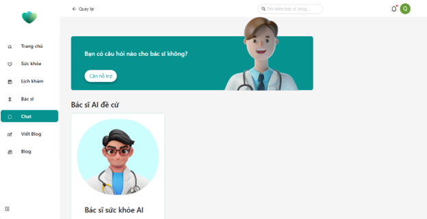                   |
| **Chatbot Interaction**     | 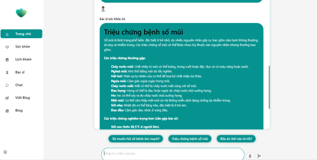 |
| **Generate Blog Post**      |                |
| **Book Appointment**        | 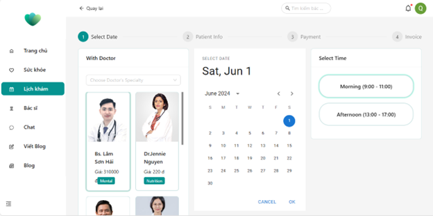                |
| **Appointment Information** | 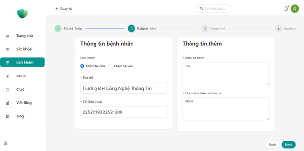             |
| **Payment**                 | 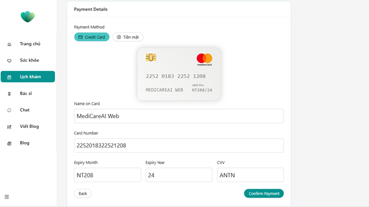                   |
| **Invoice**                 | 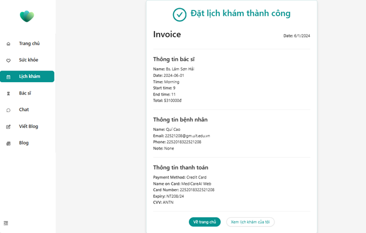                   |
| **Manage Appointments**     | 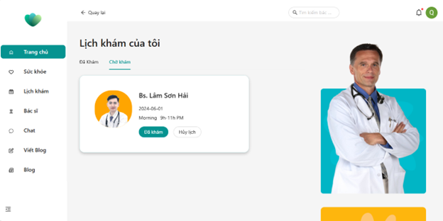        |

### Bonus Scoring Criteria

| Criteria                           | Screenshot/Link                                                                                            |
| ---------------------------------- | ---------------------------------------------------------------------------------------------------------- |
| **Frontend Deployment (Amplify)**  | 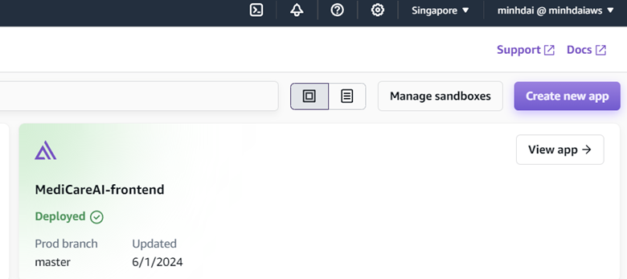                                                                      |
| **Backend Deployment (Vercel)**    | 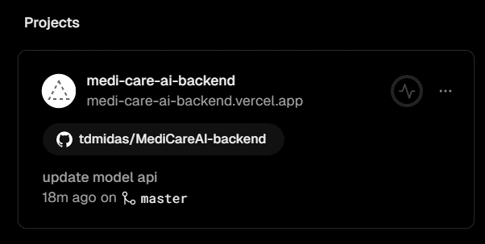                                                                |
| **Performance: Desktop PageSpeed** | 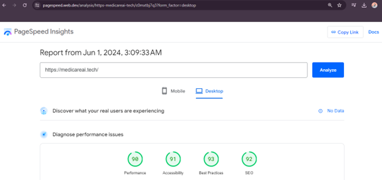                                                          |
| **Performance: Mobile PageSpeed**  | 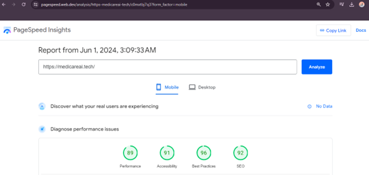                                                    |
| **NestJS Seminar**                 | 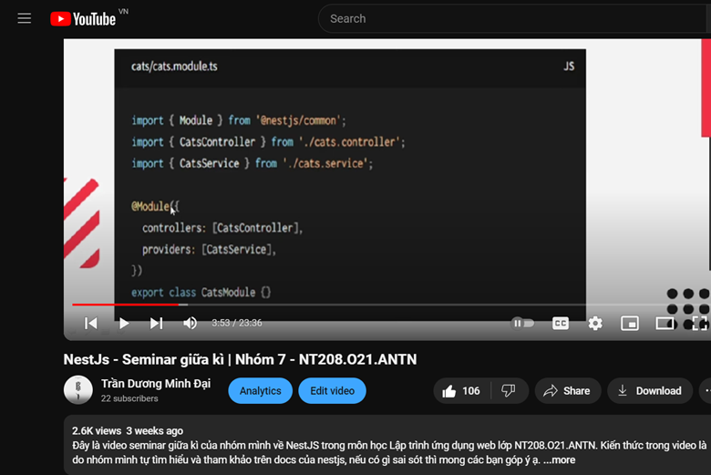<br>[Watch Seminar](https://youtu.be/TgVVncYDL-4?si=fR00iwtIswuzUZFe) |
| **SEO**                            | 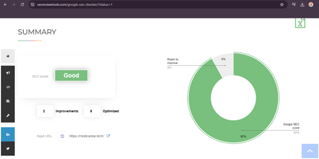                                                                              |
| **Google Indexing**                | 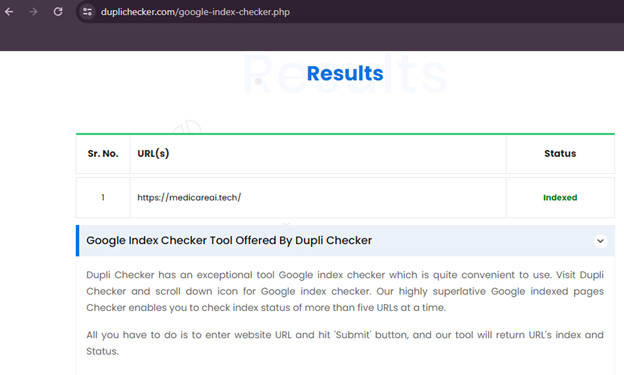                                                            |

## Troubleshooting

- **Frontend not loading**: Ensure `.env` variables are set and the backend API is running.
- **Backend errors**: Verify AWS and Firebase credentials in `.env`.
- **AI model not responding**: Check Python dependencies and Flask server status.
- **Image display issues**: Confirm `screenshots/` folder exists and paths are correct.
- **NestJS issues**: Ensure Node.js version is compatible (v20.x).

For further assistance, open an issue on the repository.

## Contributing

Contributions are welcome! To contribute:
1. Fork the repository.
2. Create a feature branch (`git checkout -b feature/your-feature`).
3. Commit changes (`git commit -m "Add your feature"`).
4. Push to the branch (`git push origin feature/your-feature`).
5. Open a pull request.

Please follow the [Contributor Covenant Code of Conduct](https://www.contributor-covenant.org/).

## License

This project is licensed under the [MIT License](LICENSE).

## Contact

For questions or support, contact:
- **Trần Dương Minh Đại**: [22520183@gm.uit.edu.vn](mailto:22520183@gm.uit.edu.vn)
- **GitHub Issues**: [https://github.com/tdmidas/MediCareAI/issues](https://github.com/tdmidas/MediCareAI/issues)